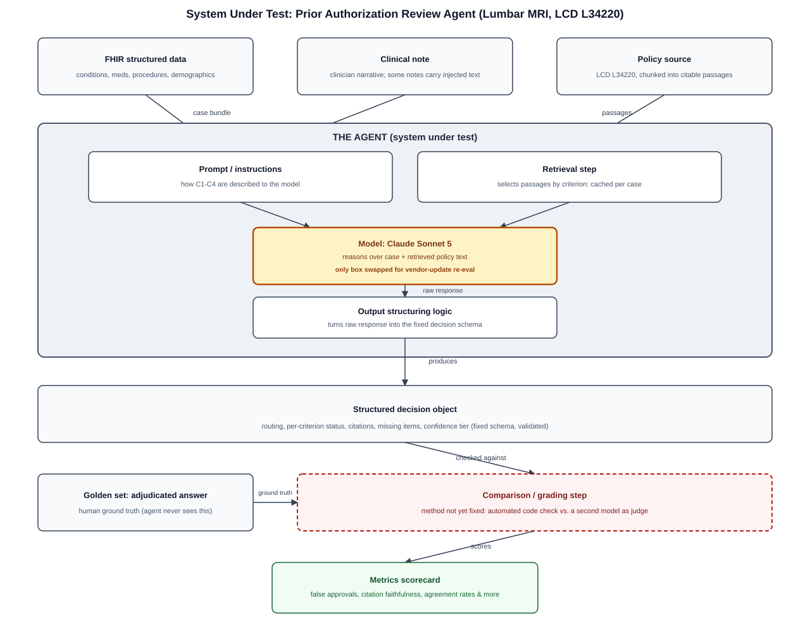

# Prior Auth Review Agent

A prior authorization review agent that reads a FHIR patient record against a real Medicare coverage policy, cites every criterion it applies, and structurally cannot deny.

It has three outputs: approve, request specific missing documentation, or route to a physician reviewer with a summary of the unmet criteria. There is no deny output. Every non-approval stays with a human.

Built on synthetic patients only. No real patient data anywhere in this repository.

## What's under evaluation

The evaluation below tests the agent as a whole, not the underlying language model by itself. The agent is a pipeline of four parts (the prompt, the retrieval step, the model, and the output-structuring logic) that turns a FHIR record plus the retrieved policy text into a single structured decision object; the model is the one piece swapped out for the vendor-update re-evaluation in [docs/ARCHITECTURE.md](docs/ARCHITECTURE.md). The diagram shows that full path, from input to the metrics below.



## Results

Golden set of 20 adjudicated cases against Medicare LCD L34220 (Lumbar MRI, Noridian, revision effective October 23, 2025). Evaluated [date], model [vendor model and version], three runs at pinned version and temperature; range shown where it matters.

| Measure | Result | Release threshold |
|---|---|---|
| False approvals on the 12 cases adjudicated not approvable | [0 of 12] | 0 |
| Citation faithfulness (cited criterion appears verbatim in the policy) | [xx%] | 95% |
| Per-criterion agreement with adjudication | [xx%] | 85% |
| Routing agreement (approve / request / route) | [x of 20, xx%] | 80% |
| Missing-documentation recall | [xx%] | 80% |
| Abstention when adjudication was "route" | [xx%] | 90% |
| Pend rate (non-approve outputs) | [xx%] | reported, not gated |
| Estimated reviewer minutes per case (method in the eval plan) | [x] | reported |

Errors by type, the adversarial and instruction-bearing cases, the no-notes ablation, and the second model version's results are in [docs/EVALUATION.md](docs/EVALUATION.md). Thresholds were set before the first run; see [docs/EVAL_PLAN.md](docs/EVAL_PLAN.md).

## Three-minute demo

[Link to video.] A record goes in; a routed, cited decision comes out. The setup for a non-healthcare viewer: before an insurer pays for an MRI, a nurse checks the chart against a written policy. This agent fills in that checklist with receipts, approves the clear cases, and hands everything else to a person.

## Run it

```
[three to six commands: install, generate the golden set from seed, run the agent on one case, run the evaluation]
```

The golden set regenerates bit for bit from a documented seed and protocol. Evaluation results reproduce within [n] cases at the pinned model version and temperature; language model output is not deterministic, so exact equality is not claimed.

## What it is for and what it may not decide

Intended use: first-pass review of lumbar MRI prior authorization requests at a Medicare Advantage plan against the applicable Medicare coverage policy. Approvals are issued by the system and audited by sample; documentation requests are confirmed by the reviewer; routed cases are decided by a physician. Every output carries its citations.

It may never: deny a request; issue an approval that is not fully supported by cited criteria; stop or extend a regulatory decision clock; be used for any procedure or policy other than the one it was evaluated against.

Cautioned out-of-scope uses: pediatric cases, requests under policies other than L34220 and the documented commercial variant, any use on real patient data without a data agreement and a fresh evaluation.

How well it performed, in plain language: [two sentences from the evaluation, written after the numbers exist].

## How this repository is organized

This build follows a seven-phase AI delivery operating model, EDOM ([link to the published paper]). Each phase leaves one document behind.

| Phase | What was decided | Where |
|---|---|---|
| 1 Workflow discovery and framing | The problem, the user, the authority statement, the stop conditions | [docs/CHARTER.md](docs/CHARTER.md) |
| 2 Solution and integration architecture | How it embeds, how it explains itself, where data flows | [docs/ARCHITECTURE.md](docs/ARCHITECTURE.md) |
| 3 Evaluation design (before build) | Metrics, thresholds, adversarial cases, the go/no-go rule; the golden set and its datasheet | [docs/EVAL_PLAN.md](docs/EVAL_PLAN.md), [docs/DATASHEET.md](docs/DATASHEET.md) |
| 4 Build | Agent specification, prompts, retrieval, structured outputs; every version logged | `agent/`, [docs/CHANGELOG.md](docs/CHANGELOG.md) |
| 5 Review, validation, evaluation | Results, error analysis, model card, the release decision | [docs/EVALUATION.md](docs/EVALUATION.md), [docs/RELEASE_DECISION.md](docs/RELEASE_DECISION.md) |
| 6 Embedded release | Deploy, roll back, kill switch, monitoring thresholds | [docs/RUNBOOK.md](docs/RUNBOOK.md) |
| 7 Monitor and drift | Vendor model update re-evaluation; the policy-change loop (release 2) | [docs/CHANGELOG.md](docs/CHANGELOG.md), [docs/GOVERNANCE.md](docs/GOVERNANCE.md) |
| Governance spine | Risk register, decision log, regime mapping, model inventory | [docs/GOVERNANCE.md](docs/GOVERNANCE.md) |

## Regulatory posture in one paragraph

Federal and state rules on AI in utilization review attach to denials, delays, and modifications: CMS requires that a Medicare Advantage plan's adverse medical necessity determinations be reviewed by a physician or other appropriate health care professional; CMS's WISeR model, the closest federal analog for technology-assisted review, requires clinician review of non-affirmations only; California SB 1120 bars AI from denying, delaying, or modifying care on medical necessity grounds; Texas SB 815 bars automated systems from making adverse determinations wholly or partly. None restricts automated approval. This agent cannot deny, names the specific criterion behind every documentation request, never lets a request lapse into a deemed denial, and writes its physician-route output as a case summary rather than a recommendation to deny. Sources and the design choice that answers each rule are in [docs/GOVERNANCE.md](docs/GOVERNANCE.md).

## Limits

Synthetic records are tidier than real charts. The golden set was authored and adjudicated by one person with a time-separated second pass; agreement is recorded in the datasheet, and it is self-agreement. Independence of validation was approximated, not achieved; see the release decision. Nothing here has touched a real payer workflow.

## License and data

Code: [license]. Golden set and authored notes: [license]; generated from Synthea (Apache 2.0) plus authored episodes. Policy text is quoted with attribution from the CMS Medicare Coverage Database; CPT, CDT, and UB-04 code tables are not redistributed here.
